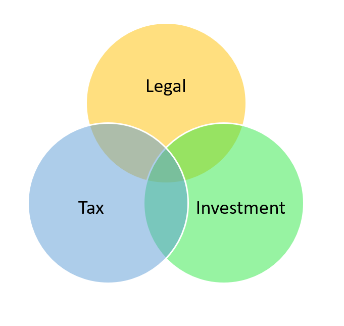
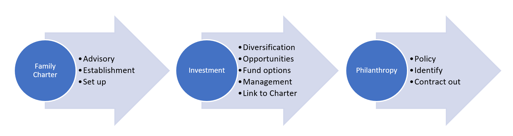

#### Hart Wealth Management

#### <Jeff@hartwm.co.nz>

#### Ph: 021 474 109

#### Offering
- Family Office establishment, reporting, management of operations.
- Governance support for Family businesses and investments.

#### Vision
Many professions purport to be Family Office specialists. There are however many parts to it and managing between the family and the business side can be complex. A Family Charter can sit in the middle to help pull together different functions including Distribution policy, statement of wishes, and investment strategy. With work then outsourced to the various professions.

### Task specific
-	Development of statement of wishes
-	Connection to family Distribution policy
-	Development of Investment policy
-	Asset allocation framework
-	Manager/ Product selection
-	Asset Transition planning.  (Moving from a concentrated to diversified multi-asset portfolio)
-	Intergenerational management transition (training & oversight)
-	Independent family support across generations

Hart Wealth Management is positioned to sit in the middle. Able to provide a holistic approach covering the many areas are likely to crop up. Working closely with families to understand and work through the set up and requirements across generations. The role can be extended (if needed) to provide governance support for investments and businesses owned by the families. Affiliations are formed with professionals who are expert in their area. Ensuring the right advice from the right pockets.

Overview

### Why Hart Wealth Management?
- We have the know-how and experience in this space.
- We have the connections and relationships that are required to make it succeed.
- A Family Office is a relatively new area where we can add value.
- Options for investment consolidation and correlating benefits.
- Industry experience to help investments and family businesses to help mentor and succeed.
